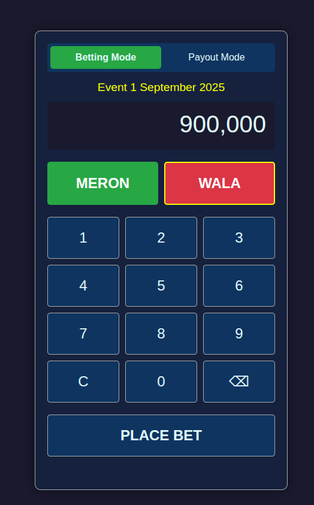
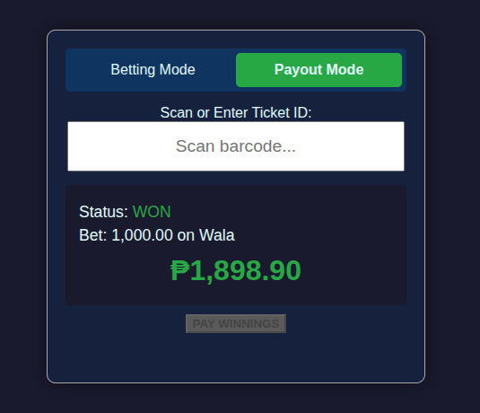
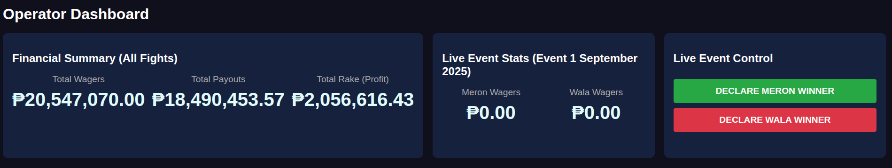
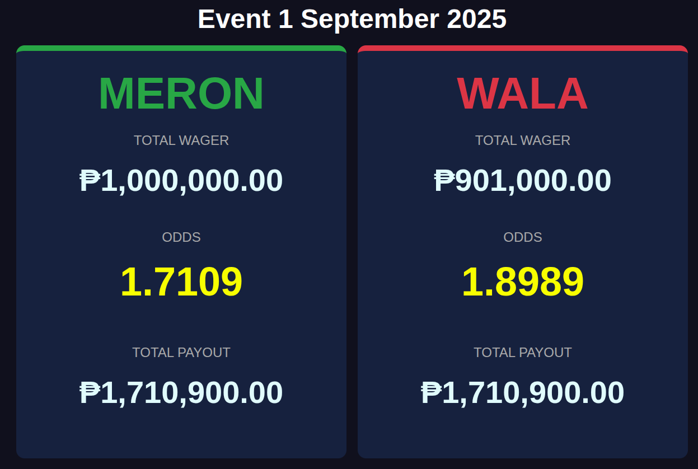
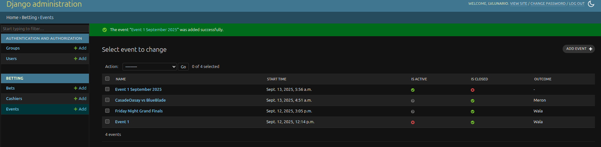
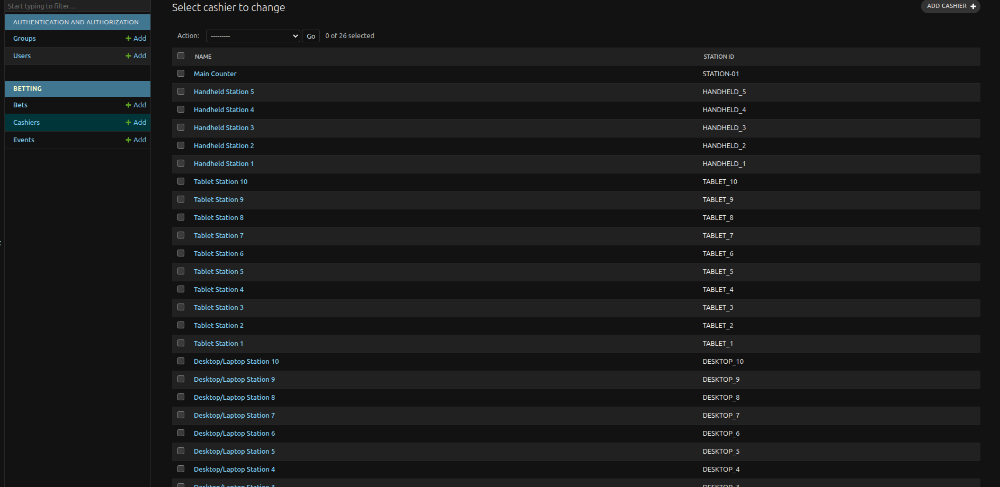
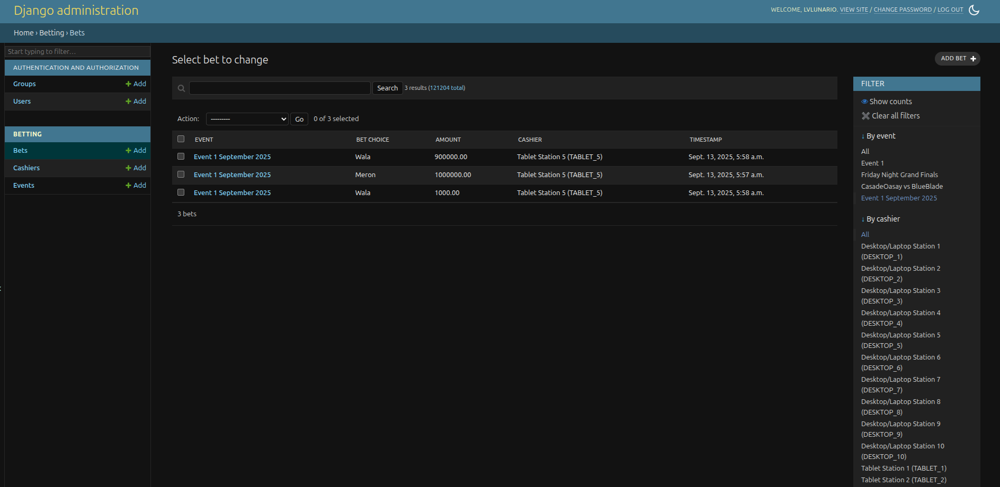
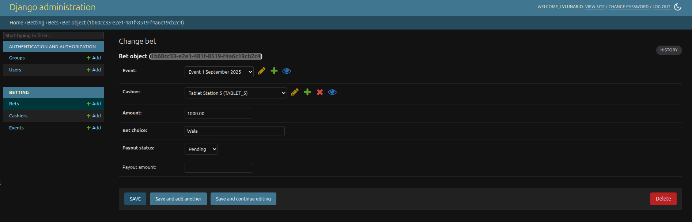

# Cockpit Betting System

This is a Django-based betting application for managing cockpit arena events. It includes interfaces for cashiers to place bets, operators to manage events, and a live totalizer display for the public.

## Key Features

* Real-time bet tracking and odds calculation.
* Separate interfaces for Cashiers, Operators, and public viewing.
* Financial summaries and rake calculation.
* Full administrative backend via Django Admin.

## Screenshots

### Cashier Interface - betting

### Cashier Interface - payout

### Operator Dashboard

### Live Totalizer Display

### Live Database Display - Events

### Live Database Display - Cashiers

### Live Database Display - Bets

### Live Database Display - ChangeBets and Barcode

